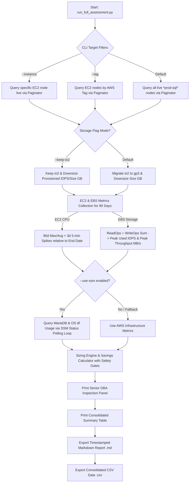

# 🏆 MariaDB AWS Capacity Planning & Rightsizing Tool

An automated, enterprise-grade assessment tool designed for **MariaDB clusters on AWS EC2 & EBS**. It retrieves CloudWatch infrastructure metrics across custom date ranges or recent sampling windows (default: **last 90 days / 3 months**), inspects internal MariaDB status metrics and OS filesystem disk usage (`df`) remotely via **AWS Systems Manager (SSM)**, filters main database data volumes, and generates executive financial and technical downsizing reports.

---

## 🎯 Architecture Strategy & Engineering Directives

1. **100% Intel Xeon Architecture (`r8i` / `m8i`)**: Recommendations stick strictly to 8th Generation Intel Xeon EC2 instance families (`r8i` / `m8i`), maintaining **100% x86_64 binary compatibility** with zero Graviton/ARM migration risk.
2. **Guaranteed Spare Headroom Baseline**: Sizing recommendations evaluate instances against historical peaks, ensuring projected downsized CPU remains **< 50% max utilization**, guaranteeing **> 50% free vCPU headroom** during peak traffic.
3. **Default 3-Month Evaluation Window (90 Days)**: Standard execution queries 90 days of CloudWatch historical data to cover quarterly traffic spikes, holiday peaks, and monthly batch jobs.
4. **Storage Throughput Sizing (`Peak MB/s` & `125 MB/s Baseline`)**:
   - Measures peak combined Read + Write Throughput in MB/s via CloudWatch.
   - Recommends **125 MB/s Throughput** (the free baseline included with EBS `gp3`), providing 50-100% spare throughput headroom for zero additional cost.
5. **Expert Disk Size Sizing & Percentage Headroom (`Used/Total %` & `% Free`)**:
   - Queries real filesystem disk usage (`df`) via SSM.
   - Displays exact **% Occupied** and **% Free Headroom** in terminal panels, ASCII summary tables, and exported Markdown/CSV reports.
   - Calculates 12-month dataset growth projection (`Used_GB * 1.20`).
   - Enforces a strict **70% max disk occupancy limit** (guaranteeing **> 30% free safety headroom** for `tmp_tables`, `ALTER TABLE` operations, and binlogs).
   - Only recommends downsizing volume size if savings are **≥ 300 GB** and current disk occupancy is **≤ 50%**, avoiding unnecessary maintenance windows for trivial gains.
6. **Flexible Storage Strategy (`--keep-io2` Flag)**:
   - **Default Mode**: Proposes migrating EBS `io2` ➡️ `gp3` provisioned at `max(4000, 1.4 * Peak_Used_IOPS)` and `125 MB/s Throughput`.
   - **`--keep-io2` Mode**: Preserves volume type as **`io2`**, but right-sizes/downsizes provisioned IOPS based on peak usage (`max(4000, 1.4 * Peak_Used_IOPS)`), calculating savings from reduced IOPS charges ($0.065/IOPS-month).
7. **Flexible Date Range Evaluation (`--start-date` & `--end-date`)**: Supports independent start/end date flags (e.g., passing only `--start-date` defaults end date to today; passing only `--end-date` calculates start date relative to `--days`).
8. **High-Resolution Short-Spike Capture (5-Minute Sampling)**: Evaluates a 3-day window relative to the evaluation end date at 5-minute granularity (`Period=300`) to capture short-lived 90% CPU spikes from cron jobs and data retention routines that would otherwise be averaged out by 90-day hourly metrics.
9. **Resilient SRE Safety Gates**: Protects against CloudWatch API throttling/network failures by requiring verified metric delivery before emitting any downsizing proposals. If CloudWatch metrics fail, the node is marked as `COLLECTION ERROR` to prevent false positive downsizing.
10. **Strict Main Data Volume Filtering**: Filters EBS volumes attached to `/dev/xvdh`, `/dev/xvdf`, `/dev/sdh`, `/dev/sdf`, or type `io2` (>100GB), explicitly ignoring OS root boot disks (`/dev/xvda`).

---

## ⚡ Quick Start & Environment Setup (First-Time Setup)

When running on any new machine or fresh virtual environment (`venv`), install `boto3` first:

```bash
# 1. Navigate to project directory
cd mariadb-rightsizing

# 2. Create virtual environment (if not created)
python3 -m venv venv
source venv/bin/activate

# 3. Install required dependencies (boto3)
pip install boto3
```

> 💡 **Fix `ModuleNotFoundError: No module named 'boto3'`**: If you see this error, run `pip install boto3` inside your activated `venv`.

---

## 📊 AWS CloudWatch Metrics Reference Table

The tool queries CloudWatch across 2 primary namespaces and flexible sampling windows:

| Namespace | Metric Name | Dimensions | Statistic | Sampling Window | Purpose / Metric Calculation |
| :--- | :--- | :--- | :--- | :--- | :--- |
| **`AWS/EC2`** | `CPUUtilization` | `InstanceId` | `Maximum`, `Average`, `p95` | **90-Day (3 Months Default)** | Evaluates average, P95, and max CPU utilization over recent 3 months |
| **`AWS/EC2`** | `CPUUtilization` | `InstanceId` | `Maximum` | **3-Day (5-Min Fine)** | Captures fast 5-minute CPU spikes (`Period=300s`) relative to evaluation end date |
| **`AWS/EBS`** | `VolumeReadOps` | `VolumeId` | `Sum` | **90-Day (3 Months Default)** | Total read operations count. Divided by `Period_Seconds` to calculate **Read IOPS/sec** |
| **`AWS/EBS`** | `VolumeWriteOps` | `VolumeId` | `Sum` | **90-Day (3 Months Default)** | Total write operations count. Divided by `Period_Seconds` to calculate **Write IOPS/sec** |
| **`AWS/EBS`** | `VolumeReadBytes` | `VolumeId` | `Sum` | **90-Day (3 Months Default)** | Total bytes read count. Converted to **Read Throughput MB/s** |
| **`AWS/EBS`** | `VolumeWriteBytes` | `VolumeId` | `Sum` | **90-Day (3 Months Default)** | Total bytes written count. Converted to **Read Throughput MB/s** |

---

## 🐬 Internal MariaDB & OS Disk SSM Metrics

When `--use-ssm` is enabled, the script executes non-intrusive internal MariaDB queries and OS disk filesystem checks (`df -P /var/lib/mysql`) via `aws ssm send-command`:

| Metric Category | Source Variable / Query | Technical Purpose |
| :--- | :--- | :--- |
| **Disk Total GB** | `df -P /var/lib/mysql` | Total provisioned filesystem size in GB |
| **Disk Used GB & %** | `df -P /var/lib/mysql` | Real used dataset storage in GB, total disk usage %, and % free headroom |
| **Buffer Pool Config** | `@@innodb_buffer_pool_size` | Total configured InnoDB Buffer Pool size in GB |
| **Real Used Buffer Pool** | `Innodb_buffer_pool_pages_data` / `total` | Exact allocated Buffer Pool occupancy in GB (`(data/total) * config`) |
| **Dirty Pages** | `Innodb_buffer_pool_pages_dirty` | Unwritten dirty data pages currently sitting in RAM |
| **Hit Ratio %** | `Hit Ratio %` | Buffer Pool cache efficiency percentage (Target > 99.5%) |
| **Wait Free Pages** | `Innodb_buffer_pool_wait_free` | Count of times queries waited for free pages (Memory pressure lock) |
| **Threads Running** | `Threads_running` | Queries actively processing in vCPUs at current millisecond |
| **Threads Connected** | `Threads_connected` | Total active open client connections |
| **Max Used Connections** | `Max_used_connections` | Historical peak client connection count |
| **Row Lock Waits** | `Innodb_row_lock_waits` | Total count of InnoDB row locking contentions |

---

## 🔄 How the Script Works



---

## 💻 Portable 1-Line Execution Commands

Once `pip install boto3` is completed inside `venv`:

#### 1. Full Inventory Assessment (Default: 3 Months / 90 Days + Migrate `io2` ➡️ `gp3`):
```bash
python3 run_full_assessment.py --profile miniclippool-databases --region us-west-2 --use-ssm
```

#### 2. Assessment Keeping `io2` Volume Type (`--keep-io2` Flag):
```bash
python3 run_full_assessment.py --profile miniclippool-databases --region us-west-2 --keep-io2 --use-ssm
```

#### 3. Single Instance Assessment (e.g., `prod-sql-qfp013`):
```bash
python3 run_full_assessment.py --profile miniclippool-databases --region us-west-2 --instance prod-sql-qfp013 --use-ssm
```

#### 4. Entire Cluster Assessment by Tag (e.g., `mc:service=secureinventory`):
```bash
python3 run_full_assessment.py --profile miniclippool-databases --region us-west-2 --tag mc:service=secureinventory --use-ssm
```

---

## 📋 CLI Arguments Reference

| Argument | Type | Default | Description |
| :--- | :--- | :--- | :--- |
| `--profile` | `string` | `miniclippool-databases` | AWS CLI authentication profile |
| `--region` | `string` | `us-west-2` | Target AWS region |
| `--instance` | `string` | `None` | Target single instance name or instance ID |
| `--tag` | `string` | `None` | Target tag filter (e.g., `mc:service=awards`) |
| `--days` | `int` | `90` | Number of recent days to evaluate (default: **90 days / 3 months**) |
| `--start-date` | `string` | `None` | Start Date (`YYYY-MM-DD`). Defaults to end-date minus `--days` if omitted. |
| `--end-date` | `string` | `None` | End Date (`YYYY-MM-DD`). Defaults to today if omitted. |
| `--use-ssm` | `flag` | `False` | Enables AWS SSM remote MariaDB status & OS disk (`df`) queries |
| `--keep-io2` | `flag` | `False` | Keeps `io2` volume type, but right-sizes/downsizes provisioned IOPS & Disk Size GB based on peak usage |
| `--output-dir` | `string` | `./reports` | Output directory for timestamped Markdown reports |

---

## 📋 Consolidated Summary Table Output Format

```text
════════════════════════════════════════════════════════════════════════════════════════════════════════════════════════════════════════════════════════════════
📊 FINAL CONSOLIDATED SUMMARY - MARIADB CAPACITY, PERFORMANCE & DOWNSIZING RECOMMENDATIONS
════════════════════════════════════════════════════════════════════════════════════════════════════════════════════════════════════════════════════════════════
| Instance                     | Current EC2   | Proposed Intel     | Peak CPU% | Proj CPU% | Data Volume             | Prov IOPS  | Peak Used IOPS  | Storage Recommendation              | EC2 Savings  | EBS Savings  | Total Savings ($/mo) |
|------------------------------|---------------|--------------------|-----------|-----------|-------------------------|------------|-----------------|-------------------------------------|--------------|--------------|----------------------|
| prod-sql-awards010           | r8i.2xlarge   | r8i.xlarge         | 9.7%      | 19.4%     | 450G/2048G (22% use) io2 | 5000 IOPS  | 412.8 IOPS      | gp3 (4000 IOPS / 125 MB/s)          | $190.26      | $412.16      | $602.42              |
| prod-sql-secureinventory002  | r6in.16xlarge | r8i.8xlarge        | 15.7%     | 31.3%     | 2150G/9500G (23% use) io2| 8000 IOPS  | 3135.9 IOPS     | gp3 3700GB (4390 IOPS / 125 MB/s)   | $1,841.79    | $1,152.50    | $2,994.29            |
════════════════════════════════════════════════════════════════════════════════════════════════════════════════════════════════════════════════════════════════
```
